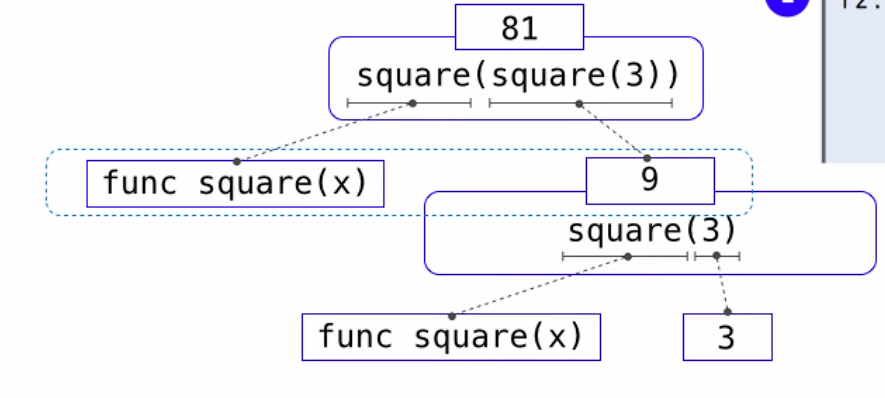
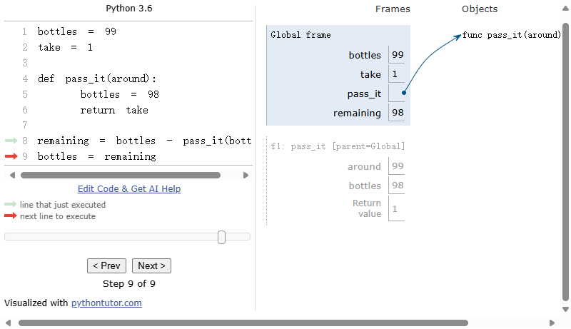
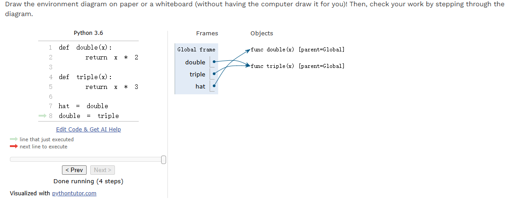

# CS61A --自学随笔 -day 01

### 树的结构（分析程序的执行步骤）

如图

------
### Environment Diagrams（这些盒子用来追踪变量名和他们的值） 
***Q1:什么因素决定了有多少个frame出现在environment diagram中？***
- A1：我觉得在运行程序时是用户调用函数的次数决定了Frame，主程序就是**Global Frame**。

***Q2:在`return value of pass_if(bottle)`发生了什么？***
- A2：`remaining = bottles - pass_it(bottles)`这里，pass_it(bottles)返回了全局变量take的值1，被临时存储在cpu寄存器/栈内存中，计算完表达式后由python的垃圾回收机制回收

***Q3：`bottle=98`对全局的框架有什么作用？***
- A3：对全局变量没有影响，生命周期只在函数作用域内。

- 有点像给对象起别名，但我不是很确定
------
