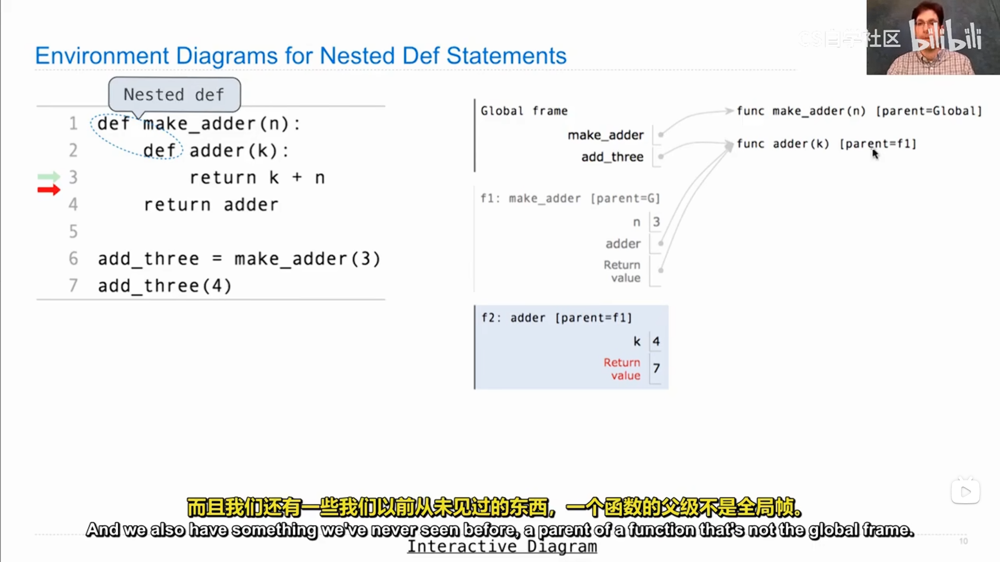
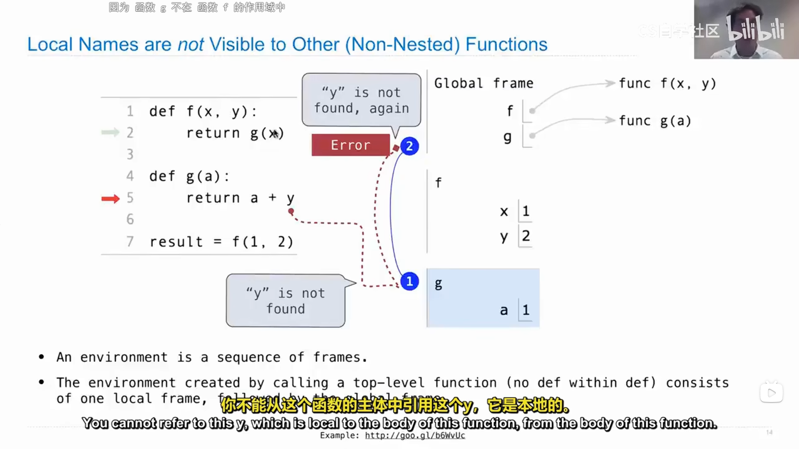
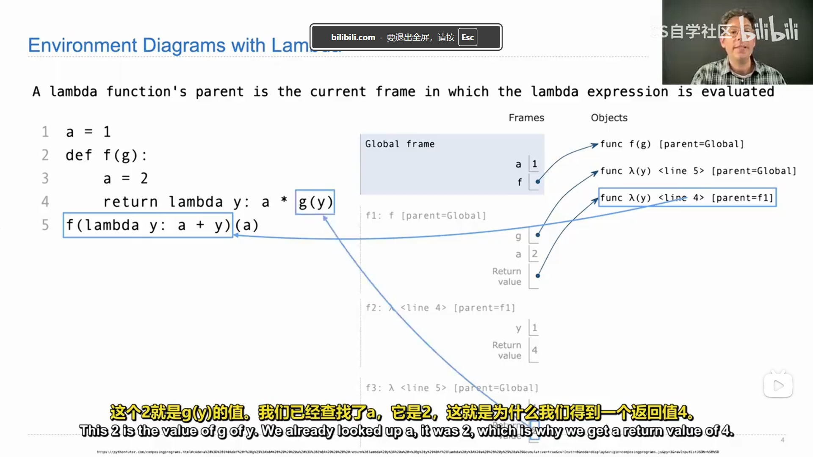
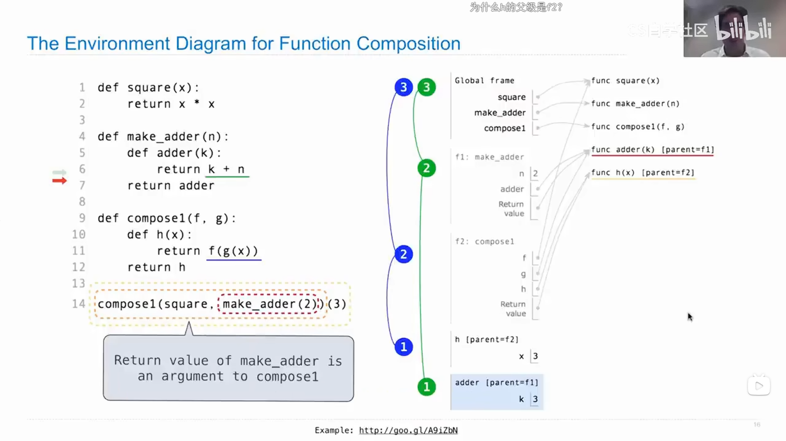

# CS61A --自学随笔 -day 02

------

## Fibonacci Sequence
- ***在设计迭代函数时，要考虑的最重要的事情之一需要跟踪哪些信息才能进行迭代（画environment diagram）***
比如斐波那契数列，要追踪的就是pre，curr，并且用k追踪第k的斐波那契数的索引

------ 

## Environment Diagrams for Nested Def Statements

- **高阶函数**-将函数作为参数
- **嵌套函数**-函数f1内部定义了其他函数如f2，并把定义的函数f2作为返回值，使得在全局框架能够访问这个函数f2，***f2属于f1框架，并且能够访问f1框架中的变量***

### How to Draw an Environment Diagram
- When a function is defined:
 * Create a function value: func<name>(<formal parameters>)[parent=<parent>]
 Its parent is the current frame.
   - `f1 : make_adder      func adder(k) [parent=f1]`
 * Bind <name> to the function value in the current frame

- Local Names are not Visible to Other(Non-Nested)Functions
- 因为g的父级框架为全局框架，y既不在g的框架中，又不在全局框架中，所以对g是不可见的，***（python执行函数体的时候好像会一层层找参数定义）***，优先级为本地框架>上级框架>上上级框架直到全局框架。

- 来看一个抽象的例子，这个就是要关注框架，逐级找定义的体现。
### 函数组合

- 评价调用表达式的时候，最好使用环境图明确函数各层的框架。

------

## Lambda 表达式
>x=10
- 10被绑定给x

>square=x*x,An expression,this one ***evaluates to a number***
- x*x的结果被绑定给square
>square=lambda x: x*x,Also an expression,***evaluates to a function***
- 匿名函数x*x被绑定给square

所以说，lambda表达式就是一个函数，但是没有return这个关键字 

### Lambda Expression Versus Def Statements 
- Lambda 直到赋值语句完成后才有名字，而def 在定义时函数就有了名字，除此之外没有其他什么区别了。

------

## 函数柯里化（Function Currying）
- 柯里化是将多参数函数转换为一个单参数高阶函数的行为，该函数返回一个接受其余参数的函数