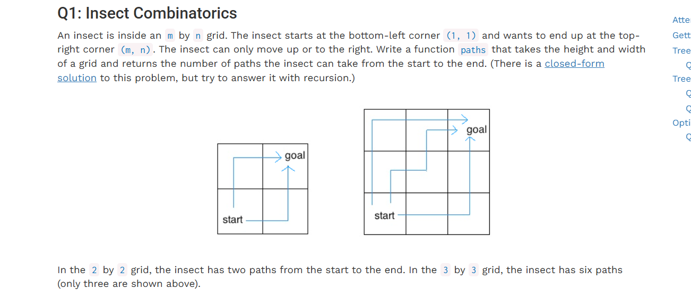

# Tree Recursion

## Definition
树递归函数是指多次调用自身的函数

---

## Practice
***Q1***:Insect Combinatorics (组合)
- 假设m,n≥2，从(m,n)移动到(1,1)的问题可以分解为子问题从(m-1,n)移动至(1,1) 
和从(m,n-1)移动至(1,1)，以及基本情况m=1，n=1 

***Q2***:max_products (list)
- 基本情况：如果s是空列表，返回1；如果s只有一个元素； 
递归情况:返回包含第一个元素和不包含第一个元素的俩种情况的较大值

***Q3***:Sum Fun (list)
- 递推思想，先相信sums(n,m)能返回正确的列表，那么sums(n,m)问题可以拆解为[k]+sums(n-k,m)的问题，直到n==0为止
- 边界情况，如果n-k<0,那么返回空列表，假如n == 0，也返回一个空列表，代表递推的结束条件

## Conclusion
1. Q1昆虫从一点(m,n)到(1,1)的路径数问题和Q2返回列表不连续乘积最大值 
的问题的解决思路，都体现了分治思想的应用。
2. Q3使用不大于m的元素组成n，将组成方式表示为列表，列表其中任意相邻俩项不能相等，体现了递推的思想